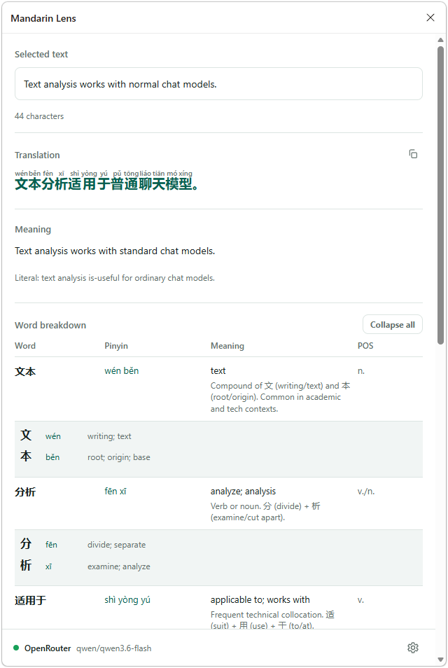
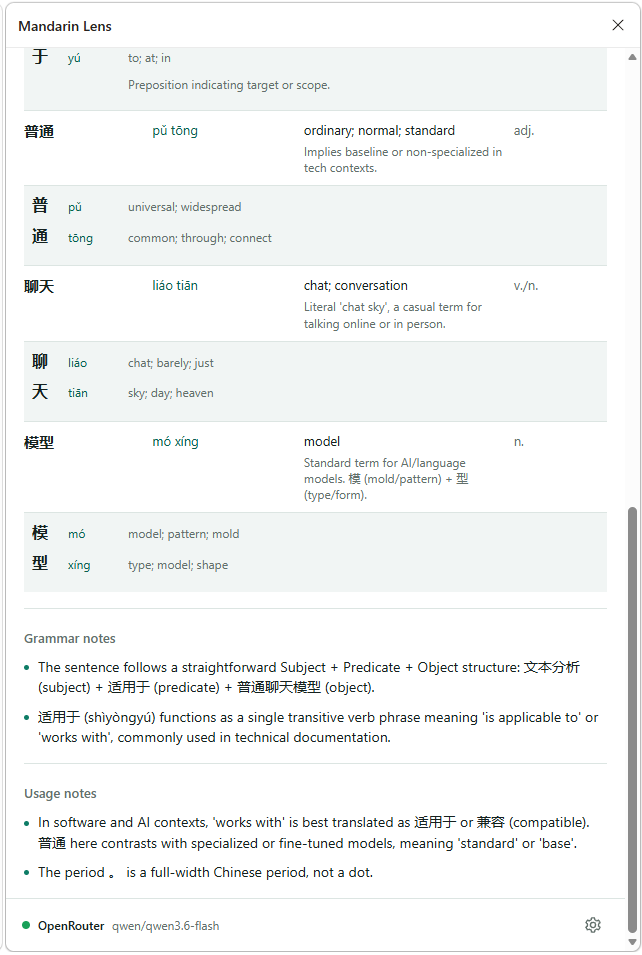
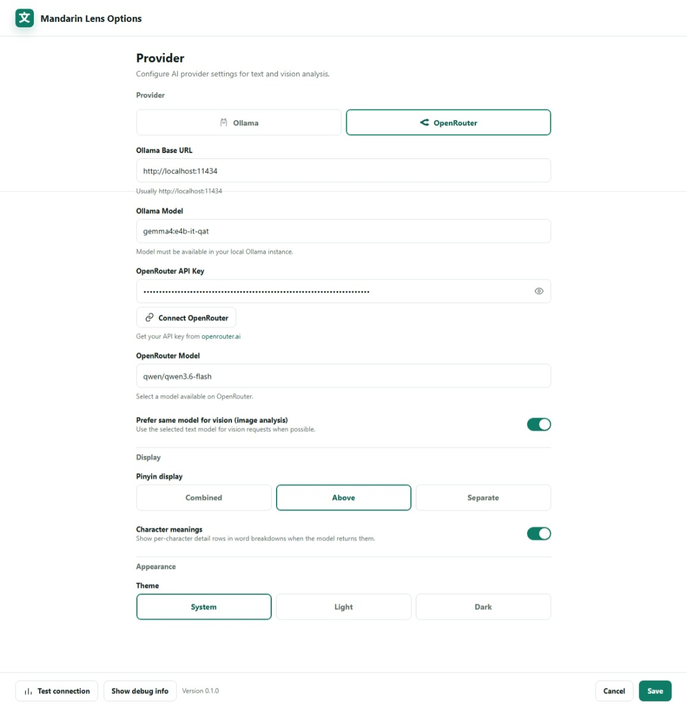

<p align="center">
  
</p>

# Mandarin Lens

Mandarin Lens is a Chrome Manifest V3 extension for Mandarin learners. Select English or Mandarin text on any webpage, right-click, and open a side-panel analysis with Simplified Chinese, pinyin, word breakdowns, grammar notes, and usage tips. You can also right-click images and send them to a vision-capable model for a Mandarin learning breakdown.

The extension can run against a local Ollama server or OpenRouter. Ollama is the default for a local-first workflow.

## Install Mandarin Lens

You do not need GitHub, Node.js, or npm to install the ready-to-use build.

1. Open the [latest Mandarin Lens release](https://github.com/willthehuman/mandarin-lens/releases/latest).
2. In the Assets section, download `mandarin-lens-chrome-extension.zip`.
3. Do not download the files named "Source code". Chrome cannot install those directly.
4. Unzip `mandarin-lens-chrome-extension.zip`.
5. Open Chrome and go to `chrome://extensions`.
6. Turn on Developer mode in the top-right corner.
7. Click Load unpacked.
8. Select the unzipped Mandarin Lens folder. Choose the folder that contains `manifest.json`.
9. Pin or open Mandarin Lens from Chrome's extensions menu.
10. Open the Mandarin Lens settings page and choose Ollama or OpenRouter.

After installing a newer release, unzip the new download, go back to `chrome://extensions`, and click the reload button on Mandarin Lens.

## Features

- Right-click selected English text and translate it to Simplified Mandarin.
- Right-click selected Mandarin text and skip translation while still showing pinyin, meaning, and breakdowns.
- Right-click images and request an image description plus useful Mandarin vocabulary.
- View results in Chrome's built-in side panel.
- Configure Ollama or OpenRouter from the extension settings page.
- Store provider settings locally with `chrome.storage.local`.
- Use structured JSON model output so the side panel can render predictable sections.
- Show clear errors for missing models, rejected Ollama origins, invalid model output, and request timeouts, with a Wait again action for timed-out requests.

## Screens

The extension has two main surfaces:

### Side panel

<p align="center">
  
  
</p>

The side panel displays source text/image URL, Mandarin, pinyin, natural meaning, literal meaning, word breakdowns, grammar notes, usage notes, warnings, and errors.

### Options page

<p align="center">
  
</p>

The options page configures provider, Ollama base URL, Ollama model, Ollama thinking, analysis timeout, OpenRouter API key, OpenRouter model, and connection testing.

## Requirements

For regular use:

- Chrome 116 or newer.
- Either:
  - Ollama running locally at `http://localhost:11434`, or
  - an OpenRouter API key.

For development:

- Node.js 24 or newer.
- npm.

## Developer Quick Start

Install dependencies:

```bash
npm install
```

Build the unpacked extension:

```bash
npm run build
```

Load the extension in Chrome:

1. Open `chrome://extensions`.
2. Enable Developer mode.
3. Click Load unpacked.
4. Select the `dist/` folder from this repository.
5. Pin or open Mandarin Lens, then open the extension settings page if you need to change providers.

After rebuilding, click the reload icon for the unpacked extension in `chrome://extensions`.

GitHub Actions also builds and publishes a fresh ready-to-install ZIP on every push to `main`.

## Using Ollama

Mandarin Lens defaults to:

- Base URL: `http://localhost:11434`
- Model: `gemma4:e4b-it-qat`

Check that Ollama can see the model:

```powershell
Invoke-RestMethod http://localhost:11434/api/tags
```

If needed, pull the model:

```bash
ollama pull gemma4:e4b-it-qat
```

### Allow Chrome Extension Origins

If the connection test returns HTTP 403, Ollama is running but rejecting the Chrome extension origin. Set `OLLAMA_ORIGINS` and restart Ollama.

For the current PowerShell session:

```powershell
$env:OLLAMA_ORIGINS = "chrome-extension://*,http://localhost:*,http://127.0.0.1:*"
ollama serve
```

For future Windows sessions:

```powershell
[Environment]::SetEnvironmentVariable(
  "OLLAMA_ORIGINS",
  "chrome-extension://*,http://localhost:*,http://127.0.0.1:*",
  "User"
)
```

If something is already listening on port `11434`, find it:

```powershell
$ollamaPid = (Get-NetTCPConnection -LocalPort 11434 -State Listen).OwningProcess
Get-CimInstance Win32_Process -Filter "ProcessId=$ollamaPid" | Select-Object ProcessId,Name,CommandLine
```

Then quit the Ollama desktop app or stop the process before restarting it with the updated origin setting.

## Using OpenRouter

Open the Mandarin Lens settings page and set:

- Provider: `OpenRouter`
- API key: your OpenRouter key
- Model: any text-capable or vision-capable OpenRouter model you want to use

Image analysis requires a model/provider combination that supports image input. Text analysis works with normal chat models.

## How It Works

The extension uses:

- `chrome.contextMenus` to add right-click menu items for text selections and images.
- `chrome.sidePanel` to open a persistent analysis panel.
- A Manifest V3 background service worker to receive context-menu clicks and dispatch requests.
- The side panel page to run the long-lived model request, avoiding Manifest V3 service-worker suspension during slow local inference.
- Provider adapters for Ollama and OpenRouter.

Ollama requests use `/api/chat` with `stream: false`, `format: "json"`, and the configured `think` value. Image requests for Ollama fetch the image and pass it as base64. OpenRouter requests use the OpenAI-compatible chat completions format with `image_url` content for image analysis.

## Project Structure

```text
public/manifest.json       Chrome extension manifest
src/background/            Context menu and side-panel dispatcher
src/sidepanel/             Result UI and long-running analysis runner
src/options/               Settings UI
src/lib/providers.ts       Ollama/OpenRouter adapters
src/lib/prompts.ts         System and user prompts
src/lib/resultParser.ts    JSON extraction and result normalization
src/lib/settings.ts        Defaults and chrome.storage helpers
src/lib/*.test.ts          Unit tests
```

## Development

Run the dev server for regular web UI iteration:

```bash
npm run dev
```

Build the unpacked extension:

```bash
npm run build
```

Run tests:

```bash
npm test
```

Watch tests:

```bash
npm run test:watch
```

Run an audit:

```bash
npm audit
```

## Troubleshooting

### The right-click item appears, but nothing opens

Reload the extension in `chrome://extensions`. The side panel must be opened directly from the context-menu user gesture; the current implementation does this before starting analysis.

### The side panel stays on "Analyzing"

Local models can be slow, especially on the first request. Mandarin Lens now runs analysis from the visible side panel and applies request timeouts. If it still hangs, open the extension service worker console and side panel console from `chrome://extensions` to inspect runtime errors.

If a model response times out, use Wait again in the side panel to rerun the same request. Adjust Analysis Timeout in settings when a local model consistently needs more time.

### Ollama returns HTTP 403

Set `OLLAMA_ORIGINS` as shown above and restart Ollama. This is usually an origin allowlist issue, not a model problem.

### Ollama says the model is missing

Check `/api/tags` and make sure the model in settings matches Ollama's model name. Ollama normalizes names to lowercase, so `gemma4:e4b-it-qat` is preferred.

### Image analysis fails with Ollama

Some images cannot be fetched by the extension page, especially `blob:`, authenticated, or CORS-sensitive images. Try a public image URL or switch to OpenRouter with a vision-capable model.

## Privacy Notes

- Settings are stored locally in Chrome extension storage.
- With Ollama, selected text and fetchable image data are sent to your local Ollama server.
- With OpenRouter, selected text and image URLs are sent to OpenRouter and the selected upstream provider.
- The extension does not bundle or download models.

## Limitations

- Right-click image support uses image URLs. It does not capture arbitrary screen regions.
- Ollama image support depends on the selected local model supporting vision input.
- Model responses must be valid or recoverable JSON. If the model ignores the JSON instruction, the extension will show a parse error.
- Mandarin Lens is not listed in the Chrome Web Store yet. Use the release ZIP for normal installation, or build the unpacked extension locally for development.

## License

Mandarin Lens is licensed under the GNU General Public License v3.0. See [LICENSE](LICENSE).
